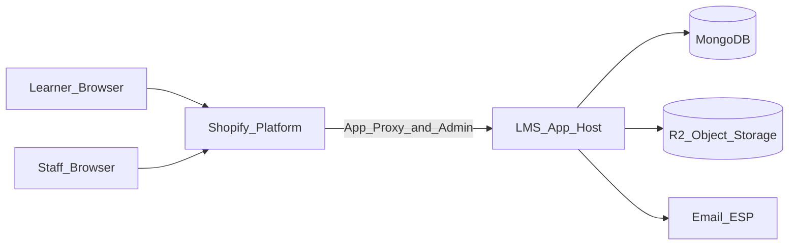
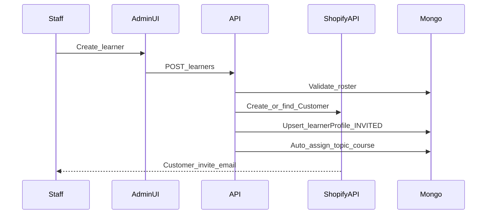
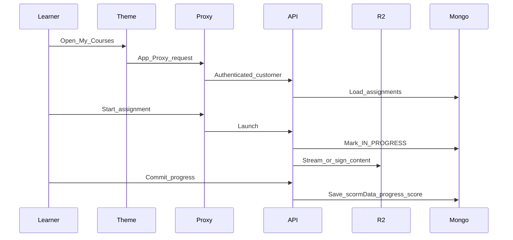
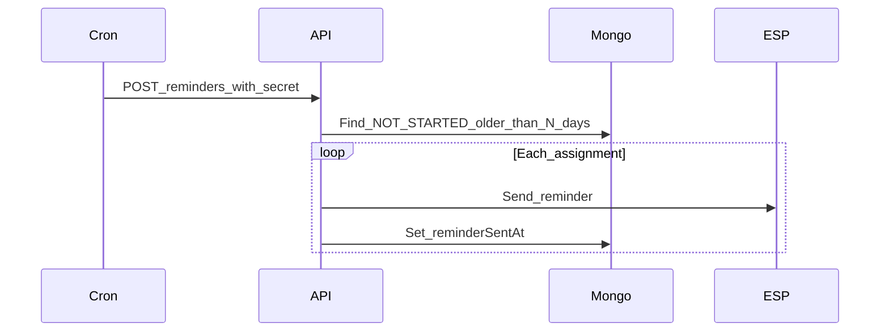
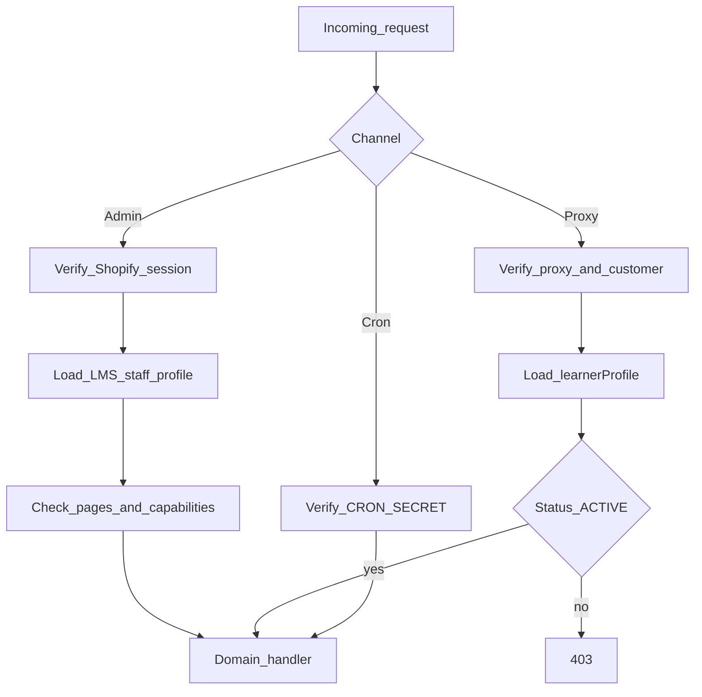

# VECTRA Shopify LMS — Architecture

**Product:** VECTRA Academy Learning Management System (Shopify edition)  
**Audience:** Engineering and DevOps  
**Auth:** Shopify Customer Accounts — LMS app does not implement auth routes  

See also: [Shopify-LMS-Overview.md](./Shopify-LMS-Overview.md) · [Shopify-LMS-Features.md](./Shopify-LMS-Features.md) · [Shopify-LMS-Data-Model.md](./Shopify-LMS-Data-Model.md)

---

## 1. Design goals

1. Deliver VECTRA Academy LMS features on the Shopify Online Store theme (not a separate Next.js app).
2. Use Shopify for identity, theme branding, and optional Admin hosting.
3. Keep SCORM, roster, assignments, progress, reports, and reminders in the Express Shopify app (`apps/lms`) with MongoDB + R2.
4. Prefer free admin assignment for v1 enrollment.
5. Default brand: VECTRA Academy.
6. Nest public LMS routes under Marketplace: `/marketplace/lms/*` → `/pages/lms-*`.

---

## 2. System context



| Actor | Entry point |
|-------|-------------|
| Learner | Online Store → `/marketplace/lms/*` → theme pages → App Proxy API |
| Staff | Same theme staff screens (tags) and/or Shopify Admin embedded app |
| Scheduler | HTTPS cron to LMS reminder endpoint |

---

## 3. Logical components

| Component | Responsibility |
|-----------|----------------|
| **Online Store theme** | VECTRA chrome, Marketplace LMS URLs, Liquid LMS screens |
| **Customer Accounts** | Invite, login, logout, password recovery |
| **App Proxy** | Authenticated learner routes under store domain |
| **Embedded Admin UI** | Participants, users, courses, reports, settings |
| **LMS API** | Domain services, authz against LMS roles, SCORM serving |
| **SCORM runtime** | Player + progress bridge (port from current `ScormPlayer` / `lib/scorm*`) |
| **Reminder worker** | Not-started assignment emails |
| **MongoDB** | Profiles, roster, courses, assignments, roles, fields |
| **R2** | Unpacked / packaged SCORM assets |
| **ESP** | Reminder email only |

---

## 4. Recommended repository structure

Target greenfield layout (can live in a new repo or a `shopify-lms/` monorepo):

```
shopify-lms/
  apps/
    lms-api/                 # Shopify app backend (Remix/Node or Next)
                             # Admin API routes, App Proxy handlers, cron
    lms-admin/               # Embedded admin UI (can be colocated with lms-api)
    lms-storefront/          # Theme app extensions, proxy templates, assets
  packages/
    scorm-runtime/           # Port from lib/scorm.ts, scorm-progress.ts, ScormPlayer
    domain/                  # participants, learners, assignments, fields, roles, reports
    db/                      # Mongo client, indexes, migrations
    mail/                    # Reminder templates + ESP adapters
  docs/
    Shopify-LMS-Overview.md
    Shopify-LMS-Features.md
    Shopify-LMS-Architecture.md
    Shopify-LMS-Data-Model.md
```

### Port mapping from this repo

| Current path | Target package / app |
|--------------|----------------------|
| `lib/types.ts` | `packages/domain` |
| `lib/participants.ts`, `lib/learners.ts`, `lib/assignments.ts` | `packages/domain` |
| `lib/fields.ts`, `lib/roles.ts`, `lib/role-catalog.ts` | `packages/domain` |
| `lib/scorm.ts`, `lib/scorm-progress.ts` | `packages/scorm-runtime` |
| `components/ScormPlayer.tsx`, `public/otto-scorm-progress-bridge.js` | `packages/scorm-runtime` + storefront |
| `lib/course-storage.ts` | `lms-api` storage adapter (R2-first) |
| `lib/mail.ts` (reminder parts) | `packages/mail` |
| `lib/reminders.ts`, `app/api/cron/reminders` | `lms-api` jobs |
| `lib/dashboard-stats.ts`, reports CSV | `packages/domain` + admin |
| `lib/branding.ts` | theme settings + app brand config (VECTRA defaults) |
| `components/Admin*.tsx`, learner pages | `lms-admin` / App Proxy UI |
| `app/api/auth/*` | **Do not port** |

---

## 5. Shopify integration points

### 5.1 Embedded admin

- Shopify App Bridge + Polaris (or existing VECTRA admin patterns adapted to embedded shell)
- Session: Shopify session token → resolve shop + staff → load LMS staff profile + role
- Nav items: Overview, Participants, Users, Courses, Reports, Settings
- Enforce LMS `pages[]` and capability flags on every admin API call

### 5.2 App Proxy (learner)

Suggested proxy subpaths (storefront URL prefix configurable):

| Proxy path | Learner screen |
|------------|----------------|
| `/apps/lms` or `/a/lms` | Dashboard |
| `/apps/lms/courses` | My Courses |
| `/apps/lms/learn/:assignmentId` | SCORM player |
| `/apps/lms/profile` | Profile |
| `/apps/lms/api/*` | Learner JSON API (progress, profile) |

App Proxy must:

1. Verify Shopify proxy signature.
2. Resolve logged-in Customer ID.
3. Load `learnerProfiles` by `shopifyCustomerId`.
4. Reject `INACTIVE` / missing profiles.

### 5.3 Customer linkage

- Store Shopify Customer GID on `learnerProfiles.shopifyCustomerId` (unique per shop).
- Staff invite: Admin API `customerCreate` / invite flow, then create LMS profile.
- Do not store password hashes or reset tokens in MongoDB.

### 5.4 Optional Product metafield

For catalog listing only:

- Product metafield `lms.course_id` → app course ObjectId / UUID
- Does not grant assignment; assignment remains app-owned

---

## 6. Key data flows

### 6.1 Staff invites learner



### 6.2 Learner launches SCORM



### 6.3 Reminder job



---

## 7. API surface (logical)

Auth routes from the current app are omitted on purpose.

### Admin API (embedded session)

| Domain | Operations |
|--------|------------|
| Participants | list, create, update, delete, import, bulk-delete |
| Users / profiles | list, create/invite, update, status, resend, import, bulk-delete |
| Courses | upload SCORM, patch metadata, replace package, delete |
| Assignments | assign, bulk-assign, unassign |
| Reports | list, CSV export |
| Fields | CRUD field definitions |
| Roles | CRUD roles |
| Overview | dashboard stats |
| Health | liveness |

### Learner API (App Proxy / customer session)

| Domain | Operations |
|--------|------------|
| Dashboard | counts / summary |
| Courses | list assignments |
| Launch | get launch URL / bootstrap player |
| Content | serve SCORM path under course |
| Progress | POST commit / finish |
| Profile | GET, PATCH display name |
| Facilities | GET roster lookup (if needed for custom flows) |

### Jobs

| Endpoint | Purpose |
|----------|---------|
| `POST /jobs/reminders` | Secured reminder runner |

---

## 8. Authorization model



Rules:

- Coordinators cannot manage roster / create staff / remove users unless a custom role grants those flags.
- Learners only access their own assignments and profile.
- Bootstrap admin profiles cannot be deleted.

---

## 9. Storage design

### MongoDB

- One database per shop installation (recommended) **or** single DB with `shopId` on every document.
- Indexes mirror current `lib/db.ts` patterns, plus `shopifyCustomerId` uniqueness.
- Collections: see [Shopify-LMS-Data-Model.md](./Shopify-LMS-Data-Model.md).

### R2 / object storage

- Key layout example: `{shopId}/courses/{courseId}/...`
- Serve via authenticated LMS content route (same-origin relative to player), not public bucket listing.
- Local filesystem adapter for development only.

### Why not Shopify Files / metafields for progress

- SCORM trees are large directory structures.
- `suspendData` and interaction payloads exceed practical metafield size.
- Progress writes are frequent; app DB is the correct store.

---

## 10. SCORM runtime architecture

Port the current approach:

1. Upload ZIP → extract → detect launch path from manifest.
2. Persist course metadata in Mongo; files in R2.
3. Player iframe loads launch HTML through LMS content URL.
4. Runtime implements SCORM 1.2 API and persists via progress endpoint.
5. Optional Mindsmith progress bridge script for postMessage updates.

Constraints (unchanged):

- SCORM 1.2 only
- Not a certified engine
- No SCORM 2004 sequencing

---

## 11. Branding architecture

| Layer | Mechanism |
|-------|-----------|
| Theme | VECTRA logo, colors, typography, footer |
| App settings | `productName`, `clientName`, `vendorName`, `vendorUrl`, `mailFromName` |
| Email | Reminder templates use product name |
| Future clients | Separate shop + theme preset, shared app code |

Default product chrome is VECTRA Academy only.

### Storefront URL nesting

Pretty paths under Marketplace redirect to Shopify page handles (theme client fallback + Admin 301s):

`/marketplace/lms` → `/pages/lms-dashboard`, `/marketplace/lms/courses` → `/pages/lms-courses`, `/marketplace/lms/learn` → `/pages/lms-learn` (query preserved), etc. Full map in the repo root README.

---

## 12. Hosting & environments

| Environment | App host | DB | SCORM storage | Shopify |
|-------------|----------|----|---------------|---------|
| Local | `npm run dev` | local Mongo | local disk or R2 | Shopify CLI / tunnel |
| Staging | Render / Azure / Fly / similar | Atlas | R2 | Staging store |
| Production | Same as staging pattern | Atlas + backups | R2 | Production VECTRA store |

Operational needs:

- `CRON_SECRET` for reminders
- ESP credentials for reminder mail
- Shopify API keys / app secrets via env
- R2 credentials
- Mongo connection string

Current Azure / Render docs in this repo remain useful for Node hosting patterns, but Shopify app install and App Proxy replace Nginx-only routing for learner auth pages.

---

## 13. Observability & hardening (recommended)

| Area | Recommendation |
|------|----------------|
| Logging | Structured logs with shopId, customerId, assignmentId |
| Metrics | Upload failures, progress commits, reminder sends |
| Backups | Mongo Atlas snapshots; R2 versioning optional |
| Security | Proxy signature verification; session token validation; ZIP size limits |
| Malware | Scan SCORM ZIPs before extract in production |
| Audit | Append-only audit collection for roster/user/course mutations |
| Privacy | Data retention policy for SCORM suspend data and exports |

---

## 14. Migration notes from a prior standalone LMS DB

If migrating an existing MongoDB:

1. Export `participants`, `courses`, `assignments`, `fieldDefinitions`, `roles`.
2. For each `users` learner: create/link Shopify Customer by email; write `learnerProfiles` without password/token fields.
3. Re-upload or copy SCORM packages into R2 under new key layout; refresh `launchPath`.
4. Remap assignment `userId` → new profile IDs.
5. Leave auth token fields behind; Shopify owns credentials.
6. Point storefront chrome at the VECTRA theme and `/marketplace/lms/*` entry URLs.

---

## 15. Build phases

| Phase | Deliverable |
|-------|-------------|
| P0 | App scaffold, Mongo, shop install, VECTRA theme shell |
| P1 | Participants + fields + roles |
| P2 | Customer-linked learner profiles + import |
| P3 | Courses + R2 + SCORM player |
| P4 | Assignments + learner dashboard/courses/profile |
| P5 | Reports + CSV + overview stats |
| P6 | Reminders + ESP |
| P7 | Hardening (scan, audit, backups, monitoring) |

---

## 16. Explicit non-goals

- A separate Next.js LMS frontend
- Porting in-app cookie JWT / bcrypt password auth flows
- Paid checkout as required enrollment path in v1
- Hydrogen headless storefront in v1
- Shopify metafields as source of truth for SCORM progress

---

**VECTRA Shopify LMS** — Architecture for Shopify edition.

*Document version: October 2026*
