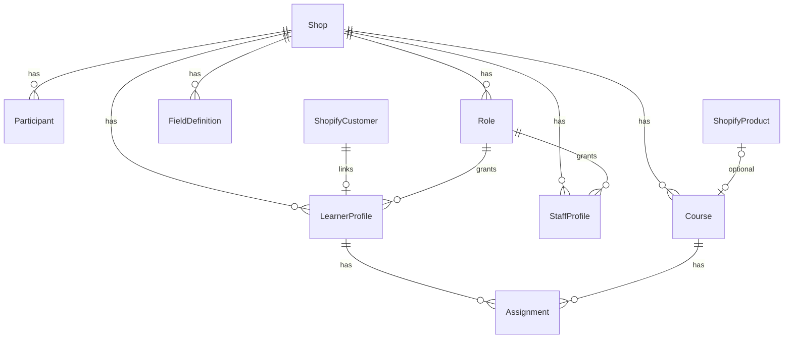

# VECTRA Shopify LMS — Data Model

**Product:** VECTRA Academy Learning Management System (Shopify edition)  
**Parity source:** [`lib/types.ts`](../lib/types.ts), [`lib/db.ts`](../lib/db.ts)  
**Auth fields:** Not stored in the LMS app (Shopify Customer Accounts)  

See also: [Shopify-LMS-Overview.md](./Shopify-LMS-Overview.md) · [Shopify-LMS-Features.md](./Shopify-LMS-Features.md) · [Shopify-LMS-Architecture.md](./Shopify-LMS-Architecture.md)

---

## 1. Ownership split

| Data | Store | Reason |
|------|-------|--------|
| Customer identity & credentials | Shopify Customer | Auth out of LMS scope |
| Staff access to Admin | Shopify staff + LMS staff profile | Dual gate |
| Roster, LMS roles, fields | App MongoDB | Flexible domain model |
| Courses & SCORM file trees | Mongo metadata + R2 blobs | Size / same-origin serving |
| Assignments & progress | App MongoDB | Frequent writes; large `scormData` |
| Optional catalog pointer | Shopify Product metafield | Merchandising only |
| Reminder send state | App MongoDB (`reminderSentAt`) | Job idempotency |

---

## 2. Entity relationship overview



All app collections include `shopId` (Shopify shop domain or GID) unless the deployment uses an isolated database per shop.

---

## 3. Shopify objects

### 3.1 Customer

| Shopify field | LMS use |
|---------------|---------|
| Customer GID | `learnerProfiles.shopifyCustomerId` |
| email | Canonical login email; mirrored on profile |
| first_name / last_name | Synced on invite; display name editable in LMS |
| tags (optional) | e.g. `lms-learner`, `facility`, `business-partner` |
| metafields (optional) | Lightweight mirrors only — not source of truth for roster |

Do **not** use Customer metafields for SCORM suspend data or full assignment history.

### 3.2 Staff

| Shopify concept | LMS use |
|-----------------|---------|
| Staff member / collaborator | May open embedded app |
| App permission scopes | Install-time API access |
| `staffProfiles` row | LMS role, pages, capabilities |

### 3.3 Product (optional)

| Metafield | Type | Purpose |
|-----------|------|---------|
| `lms.course_id` | single line text | Points to app `courses._id` |
| `lms.active` | boolean | Optional storefront visibility flag |

Products do not grant learning entitlements in v1.

### 3.4 Theme settings

Brand strings and assets (logo, colors) live in theme settings / theme app extension config — not MongoDB.

---

## 4. App MongoDB collections

Types below mirror the current LMS documents with Shopify linkage fields added and auth-secret fields removed.

### 4.1 Shared enums

```ts
type SystemRole = "ADMIN" | "COORDINATOR" | "LEARNER";
type UserRole = string; // system or custom role key
type UserStatus = "INVITED" | "ACTIVE" | "INACTIVE";
type StaffPage =
  | "overview"
  | "participants"
  | "users"
  | "courses"
  | "reports"
  | "settings";
type CourseType = "SCORM_12" | "MINDSMITH_LINK";
type AssignmentStatus = "NOT_STARTED" | "IN_PROGRESS" | "COMPLETED";
type StakeholderGroup = "Business Partner" | "Facility";
type FieldType = "text" | "dropdown";
```

### 4.2 `learnerProfiles` (replaces most of `users` for learners)

| Field | Type | Notes |
|-------|------|-------|
| `_id` | ObjectId | App primary key |
| `shopId` | string | Shop scope |
| `shopifyCustomerId` | string | Unique per shop; Customer GID |
| `firstName` | string | |
| `lastName` | string | |
| `email` | string | Unique per shop |
| `entity` | string | Organization name |
| `companyId` | string? | Roster link |
| `stakeholderGroup` | StakeholderGroup? | |
| `facilityTraining` | string? | |
| `belongsToBp` | string? | |
| `country` | string? | |
| `topic` | string? | Auto-assign match |
| `nominatedProvider` | string? | |
| `customFields` | Record\<string, string\>? | From field definitions |
| `role` | UserRole | Usually `LEARNER` |
| `status` | UserStatus | LMS gate |
| `createdAt` / `updatedAt` | Date | |

**Removed vs current `UserDocument`:** `passwordHash`, `inviteTokenHash`, `inviteExpiresAt`, `resetTokenHash`, `resetExpiresAt`.

**Indexes (recommended):**

- unique `(shopId, email)`
- unique `(shopId, shopifyCustomerId)`
- `(shopId, companyId, stakeholderGroup)`
- `(shopId, status, role)`

### 4.3 `staffProfiles`

| Field | Type | Notes |
|-------|------|-------|
| `_id` | ObjectId | |
| `shopId` | string | |
| `shopifyStaffId` | string? | When available |
| `email` | string | Unique per shop |
| `firstName` / `lastName` | string | |
| `role` | UserRole | ADMIN / COORDINATOR / custom |
| `bootstrap` | boolean | Cannot delete if true |
| `createdAt` / `updatedAt` | Date | |

Staff who are also learners may have both a `staffProfiles` and `learnerProfiles` row; prefer separate documents.

### 4.4 `participants` (unchanged domain)

| Field | Type | Notes |
|-------|------|-------|
| `_id` | ObjectId | |
| `shopId` | string | |
| `stakeholderGroup` | StakeholderGroup | |
| `companyId` | string | |
| `name` | string | Organization name |
| `belongsToBp` | string | |
| `country` | string | |
| `topic` | string | |
| `nominatedProvider` | string | |
| `customFields` | Record\<string, string\>? | |
| `active` | boolean | |
| `createdAt` / `updatedAt` | Date | |

**Unique index:** `(shopId, companyId, name, stakeholderGroup)`  
(Parity with current unique `(companyId, name, stakeholderGroup)`.)

### 4.5 `courses`

| Field | Type | Notes |
|-------|------|-------|
| `_id` | ObjectId | |
| `shopId` | string | |
| `title` | string | |
| `description` | string | |
| `type` | CourseType | `SCORM_12` operational |
| `active` | boolean | |
| `externalUrl` | string? | Reserved for link type |
| `launchPath` | string? | Relative path inside package |
| `originalFilename` | string? | Upload name |
| `storagePrefix` | string? | R2 key prefix |
| `shopifyProductId` | string? | Optional Product GID |
| `createdAt` / `updatedAt` | Date | |

### 4.6 `assignments`

| Field | Type | Notes |
|-------|------|-------|
| `_id` | ObjectId | |
| `shopId` | string | |
| `userId` | ObjectId | → `learnerProfiles._id` |
| `courseId` | ObjectId | → `courses._id` |
| `status` | AssignmentStatus | |
| `progress` | number | 0–100 |
| `score` | number? | |
| `scormData` | ScormData | See below |
| `assignedAt` | Date | |
| `lastActivityAt` | Date? | |
| `completedAt` | Date? | |
| `reminderSentAt` | Date? | |
| `updatedAt` | Date | |

**Unique index:** `(shopId, userId, courseId)`

#### `ScormData` (parity with current)

| Field | Type |
|-------|------|
| `lessonLocation` | string? |
| `lessonStatus` | string? |
| `scoreRaw` / `scoreMin` / `scoreMax` | number? |
| `progressMeasure` | number? |
| `interactionCount` | number? |
| `activitySteps` | number? |
| `lastProgressBumpAt` | Date? |
| `suspendData` | string? |
| `totalTime` / `sessionTime` | string? |
| `exit` | string? |

Store in MongoDB only — not Shopify metafields.

### 4.7 `roles`

| Field | Type | Notes |
|-------|------|-------|
| `_id` | ObjectId | |
| `shopId` | string | |
| `key` | UserRole | e.g. `ADMIN` |
| `name` | string | |
| `description` | string | |
| `system` | boolean | System roles locked |
| `pages` | StaffPage[] | |
| `canManageRoster` | boolean | |
| `canCreateStaff` | boolean | |
| `canRemoveUsers` | boolean | |
| `createdAt` / `updatedAt` | Date | |

**Unique index:** `(shopId, key)`

Seed per shop: `ADMIN`, `COORDINATOR`, `LEARNER` (same capability defaults as `lib/role-catalog.ts`).

### 4.8 `fieldDefinitions`

| Field | Type | Notes |
|-------|------|-------|
| `_id` | ObjectId | |
| `shopId` | string | |
| `key` | string | Stable machine key |
| `label` | string | |
| `type` | FieldType | `text` \| `dropdown` |
| `required` | boolean | |
| `options` | string[] | |
| `system` | boolean | |
| `lockedOptions` | boolean | |
| `copyToUser` | boolean | Roster → profile |
| `filterable` | boolean | |
| `order` | number | |
| `createdAt` / `updatedAt` | Date | |

**Unique index:** `(shopId, key)`

Locked system keys (parity): `stakeholderGroup`, `companyId`, `name`.

### 4.9 Optional `auditEvents` (recommended follow-up)

| Field | Type |
|-------|------|
| `shopId` | string |
| `actorProfileId` | string |
| `action` | string |
| `entityType` | string |
| `entityId` | string |
| `payload` | object |
| `createdAt` | Date |

---

## 5. Mapping from prior LMS collections

| Current collection | Shopify LMS | Transformation |
|--------------------|-------------|----------------|
| `users` (learners) | `learnerProfiles` + Shopify Customer | Drop password/invite/reset hashes; add `shopifyCustomerId`, `shopId` |
| `users` (staff) | `staffProfiles` | Split from learners; map email to Shopify staff where possible |
| `participants` | `participants` | Add `shopId` |
| `courses` | `courses` | Add `shopId`, `storagePrefix`, optional `shopifyProductId` |
| `assignments` | `assignments` | Remap `userId` to `learnerProfiles._id`; add `shopId` |
| `roles` | `roles` | Add `shopId`; re-seed system roles |
| `fieldDefinitions` | `fieldDefinitions` | Add `shopId` |

---

## 6. Object storage layout (R2)

```
{shopId}/
  courses/
    {courseId}/
      package.zip          # optional retained original
      extracted/
        imsmanifest.xml
        ...launch files...
```

Mongo `courses.launchPath` is relative to `extracted/` (same idea as current `launchPath`).

Local dev adapter may use `COURSE_STORAGE_DIR/{shopId}/courses/{courseId}/...`.

---

## 7. Session / permission derived shapes

Port the current session helpers conceptually (without JWT cookies):

```ts
interface SessionPermissions {
  staff: boolean;
  manageRoster: boolean;
  manageCourses: boolean;
  manageUsers: boolean;
  createStaff: boolean;
  removeUsers: boolean;
  viewReports: boolean;
  manageSettings: boolean;
}

interface StaffSession {
  shopId: string;
  profileId: string;
  email: string;
  firstName: string;
  lastName: string;
  role: UserRole;
  roleName: string;
  pages: StaffPage[];
  permissions: SessionPermissions;
}

interface LearnerSession {
  shopId: string;
  profileId: string;
  shopifyCustomerId: string;
  email: string;
  firstName: string;
  lastName: string;
  entity: string;
  status: UserStatus;
}
```

Admin APIs authorize via `StaffSession`. App Proxy APIs authorize via `LearnerSession` with `status === "ACTIVE"`.

---

## 8. Validation rules (parity)

| Rule | Enforcement |
|------|-------------|
| Learner invite requires roster match on Company ID + stakeholder group + org name | App service |
| Unique email per shop | Mongo unique index |
| Unique assignment per learner+course | Mongo unique index |
| Cannot delete bootstrap staff | App service |
| Cannot delete own staff profile | App service |
| Course delete cascades assignments | App service |
| SCORM replace keeps course id; refreshes storage + launchPath | App service |
| Auto-assign matches active `SCORM_12` course to learner `topic` | App service (`lib/learners.ts` parity) |

---

## 9. CSV / import column contracts

### Participants

Required: `Stakeholder`, `ID`, `Name`, `Belongs to BP`, `Country`, `Topic`, `Nominated Provider`  
Plus dynamic headers for non-system field definitions.

### Learners

Required: `First Name`, `Last Name`, `Corporate Email`, `Company ID`, `Stakeholder Group`, `Organizational Name`

Import creates/links Shopify Customers and `learnerProfiles`; it does not set passwords.

### Reports export

Columns match Features doc: name, email, entity, country, topic (+ dynamic), course, status, progress, score, last activity, completed at.

---

## 10. Environment variables (app)

| Variable | Purpose |
|----------|---------|
| `MONGODB_URI` / `MONGODB_DB` | App database |
| `R2_*` | Course object storage |
| `SHOPIFY_API_KEY` / `SHOPIFY_API_SECRET` / `SCOPES` | App credentials |
| `APP_URL` | App host URL |
| `CRON_SECRET` | Reminder job auth |
| `REMINDER_DAYS` | Not-started threshold |
| `BREVO_API_KEY` / `RESEND_API_KEY` / SMTP_* | Reminder ESP |
| `MAIL_FROM` | Reminder from address |
| `LMS_PRODUCT_NAME` etc. | VECTRA brand defaults |
| `MAX_SCORM_UPLOAD_MB` | Upload limit |

No `AUTH_SECRET` / password bootstrap pair is required for learner auth. Staff bootstrap can use install-time seed emails (`BOOTSTRAP_ADMIN_EMAILS` equivalent) to create `staffProfiles` with `ADMIN`.

---

## 11. What must never move to Shopify metafields

- Full `scormData` / `suspendData`
- Assignment history tables for reporting
- Participant roster as the only copy (keep app DB source of truth)
- Custom role permission matrices
- Reminder idempotency state

Metafields may hold small mirrors (e.g. company ID on Customer) for theme display, but the app DB remains authoritative.

---

**VECTRA Shopify LMS** — Data model for Shopify edition.

*Document version: October 2026*
