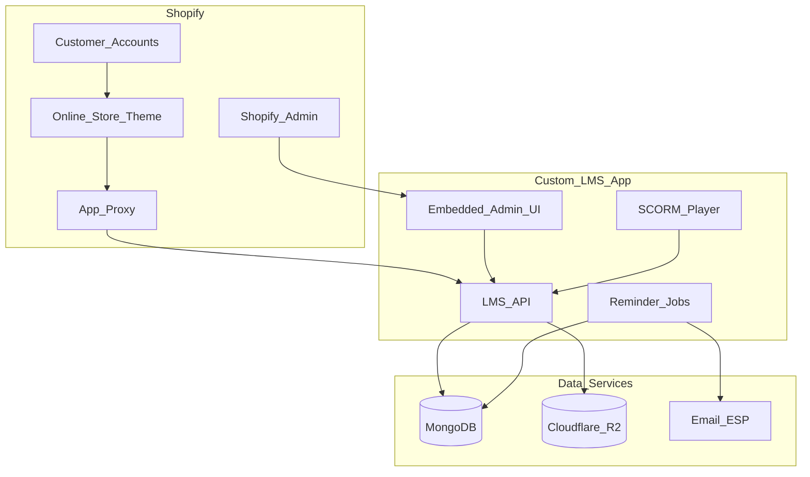

# VECTRA Shopify LMS — Overview

**Product:** VECTRA Academy Learning Management System (Shopify edition)  
**Audience:** VECTRA International product, engineering, and operations teams  
**Purpose:** Design overview for VECTRA Academy on the Shopify theme + Express app proxy  
**Auth:** Out of scope — Shopify Customer Accounts own invite, login, and password recovery  

Related docs:

| Document | Purpose |
|----------|---------|
| [Shopify-LMS-Features.md](./Shopify-LMS-Features.md) | Full feature inventory |
| [Shopify-LMS-Architecture.md](./Shopify-LMS-Architecture.md) | System design, repo structure, flows |
| [Shopify-LMS-Data-Model.md](./Shopify-LMS-Data-Model.md) | Shopify objects + app DB mapping |

---

## 1. Vision

Ship a VECTRA-branded LMS (roster, users, SCORM courses, assignments, progress, reports, roles, reminders) as part of this Shopify theme project. Identity and storefront chrome live on Shopify; LMS domain data stays in the Express app’s MongoDB + object storage.

Public learner/staff UI URLs nest under Marketplace (`/marketplace/lms/...`) and redirect to theme pages (`/pages/lms-*`). The API is `/apps/lms/api/*` via App Proxy. This is not a Next.js frontend.

### Locked product decisions

| Decision | Choice |
|----------|--------|
| Brand | VECTRA Academy |
| Enrollment | Free admin assignment |
| Learner / staff storefront UI | Online Store theme (Liquid) under `/marketplace/lms/*` |
| Staff API shell (optional later) | Shopify Admin embedded app |
| Course runtime | Custom SCORM 1.2 player (theme + app) |
| LMS data | MongoDB (app DB) |
| SCORM packages | Cloudflare R2 (or equivalent object storage) |
| Auth | Shopify Customer Accounts only |

---

## 2. What Shopify owns vs what the app owns

| Concern | Owner | Notes |
|---------|-------|-------|
| Customer invite / login / logout / password recovery | Shopify | Customer Accounts |
| Theme, VECTRA branding, storefront navigation | Shopify | Online Store theme |
| Staff shell and app install | Shopify | Admin + app permissions |
| Optional future paid enrollment | Shopify | Products / Checkout (not required for v1) |
| Participant roster | Custom app | Approved org gate |
| Learner business profile fields | Custom app | Linked to Customer GID |
| Custom field definitions | Custom app | Text / dropdown, import, filters |
| Staff LMS roles & page matrix | Custom app | Admin / Coordinator / custom |
| Course metadata + SCORM upload | Custom app | ZIP → R2 |
| Assignments & entitlements | Custom app | Free assign / unassign / bulk |
| Progress, score, SCORM suspend data | Custom app | Too large for metafields |
| Learner dashboard & course list | App via App Proxy | Theme embeds proxied pages |
| SCORM player | Custom app | Same-origin content + runtime |
| Reports + CSV | Custom app | Embedded admin |
| Assignment reminders | Custom app | Cron / scheduled job + ESP |
| Facility / Company ID lookup | Custom app | Roster validation helper |

---

## 3. High-level architecture

### Runtime story

1. Staff open the embedded LMS app inside Shopify Admin to manage roster, learners, courses, assignments, reports, and settings.
2. Learners sign in with Shopify Customer Accounts on the Online Store.
3. Theme pages call App Proxy routes for dashboard, courses, profile, and the SCORM player.
4. The LMS API reads/writes MongoDB for domain data and serves SCORM assets from R2.
5. Reminder jobs email learners who have not started assigned courses after N days.

---

## 4. Feature modules (summary)

| Module | Staff | Learner | Parity with current LMS |
|--------|-------|---------|-------------------------|
| Participants roster | CRUD, import, bulk delete | — | Yes |
| Users / learners | Invite link to Customer, import, status, assign | — | Yes (auth via Shopify) |
| Courses / SCORM | Upload, edit, replace, delete | Play assigned content | Yes |
| Assignments | Single / bulk / unassign / topic auto-assign | See on dashboard | Yes |
| Dashboard & courses | Overview stats | Counts, list, Start/Continue/Review | Yes |
| Profile | — | Edit display name; roster fields read-only | Yes |
| Reports | Filters + CSV | — | Yes |
| Settings | Field definitions + roles | — | Yes |
| Reminders | Configure days / secret | Receive email | Yes |
| Branding | Theme + app brand config | VECTRA storefront | Yes (VECTRA default) |
| Auth screens | Shopify | Shopify | Explicitly out of scope |

Full checklists: [Shopify-LMS-Features.md](./Shopify-LMS-Features.md).

---

## 5. Screens

### Staff (embedded app)

| Screen | Purpose |
|--------|---------|
| Overview | Org / learner / course / completion stats + onboarding checklist |
| Participants | Approved organization roster |
| Users | Learners and staff LMS roles |
| Courses | SCORM upload, metadata, assign / unassign |
| Reports | Progress table + CSV export |
| Settings | Custom fields + user groups / permissions |

### Learner (theme + App Proxy)

| Screen | Purpose |
|--------|---------|
| Dashboard | Assigned / in progress / completed counts |
| My Courses | Status badges; Start / Continue / Review |
| Player | SCORM 1.2 runtime for an assignment |
| Profile | Display name edit; read-only org fields |

### Auth (Shopify — not built by LMS app)

Login, account activation/invite, and password recovery are Shopify Customer Account flows. The LMS app only consumes an authenticated customer session at the App Proxy boundary.

---

## 6. Mapping from the current project

This repo (`otto-lms-node-azure`) is the functional source of truth:

| Current area | Primary paths | Shopify LMS target |
|--------------|---------------|--------------------|
| Domain types | `lib/types.ts` | App DB collections |
| Roles | `lib/roles.ts`, `lib/role-catalog.ts` | App roles + Shopify staff access |
| Branding | `lib/branding.ts` | Theme + VECTRA brand config |
| Participants | `lib/participants.ts`, admin APIs | Embedded app module |
| Learners / auto-assign | `lib/learners.ts` | App assignment service |
| SCORM | `lib/scorm.ts`, `lib/scorm-progress.ts`, `components/ScormPlayer.tsx` | `packages/scorm-runtime` |
| Storage | `lib/course-storage.ts` | R2 |
| Reports | `lib/dashboard-stats.ts`, reports CSV API | Embedded reports |
| Reminders | `lib/reminders.ts`, `/api/cron/reminders` | Scheduled app job |
| Mail | `lib/mail.ts` | ESP for training reminders (not auth mail) |

---

## 7. Why Shopify alone is not enough

Shopify does not provide:

- A SCORM 1.2 runtime with resume, score, and completion
- Durable same-origin hosting for unpacked course packages
- Flexible roster field definitions that drive CSV import and report columns
- Assignment progress aggregation with reminder engine
- Coordinator vs admin page matrix beyond native staff permissions

Those capabilities stay in the custom app. Shopify provides identity, theme, and admin hosting.

---

## 8. Storefront URL nesting

LMS is part of the Marketplace surface. Pretty paths redirect to flat Shopify page handles:

| Pretty path | Page handle |
|-------------|-------------|
| `/marketplace/lms` | `lms-dashboard` |
| `/marketplace/lms/dashboard` | `lms-dashboard` |
| `/marketplace/lms/my-courses` | `lms-my-courses` |
| `/marketplace/lms/profile` | `lms-profile` |
| `/marketplace/lms/learn` | `lms-learn` |
| `/marketplace/lms/admin` | `lms-admin` |
| `/marketplace/lms/participants` | `lms-participants` |
| `/marketplace/lms/users` | `lms-users` |
| `/marketplace/lms/courses` | `lms-courses` |
| `/marketplace/lms/reports` | `lms-reports` |
| `/marketplace/lms/settings` | `lms-settings` |

Implement client redirects in the theme (`snippets/vectra-redirects.liquid`) and mirror them in Shopify Admin → Navigation → URL redirects for 301s.

---

## 9. Non-goals for v1

- Rebuilding login / register / activate / reset inside the LMS app
- Paid checkout enrollment as the primary path
- Headless Hydrogen or Next.js storefront (theme + App Proxy is the learner UI)
- Moving SCORM progress / roster into Shopify metafields as source of truth
- SCORM 2004 sequencing
- Certified SCORM engine claim

---

## 10. Recommended build order

1. Scaffold Shopify app (embedded admin + App Proxy + MongoDB + R2).
2. Port participants, fields, and roles.
3. Link Shopify Customers to `learnerProfiles`; staff invite creates Customer + profile.
4. Port courses, SCORM storage, and player.
5. Port assignments, learner dashboard, and progress API.
6. Port reports / CSV and reminder jobs.
7. Apply VECTRA theme branding, Marketplace URL nesting, and staff onboarding checklist.

---

## 11. Known limitations (carry forward)

1. SCORM 1.2 only; not a certified engine; no 2004 sequencing.
2. Mindsmith published URLs are not used for compliance tracking — export SCORM ZIP.
3. Production needs MongoDB Atlas (or equivalent) with backups.
4. SCORM ZIP malware scanning is recommended before broad admin upload access.
5. Formal audit logging is recommended for compliance rollouts.
6. Auth email deliverability is Shopify’s concern; reminder email still needs SPF/DKIM/DMARC on the ESP domain.

---

**VECTRA Shopify LMS** — Design overview for Academy on Shopify theme + Express app.

*Document version: October 2026*
